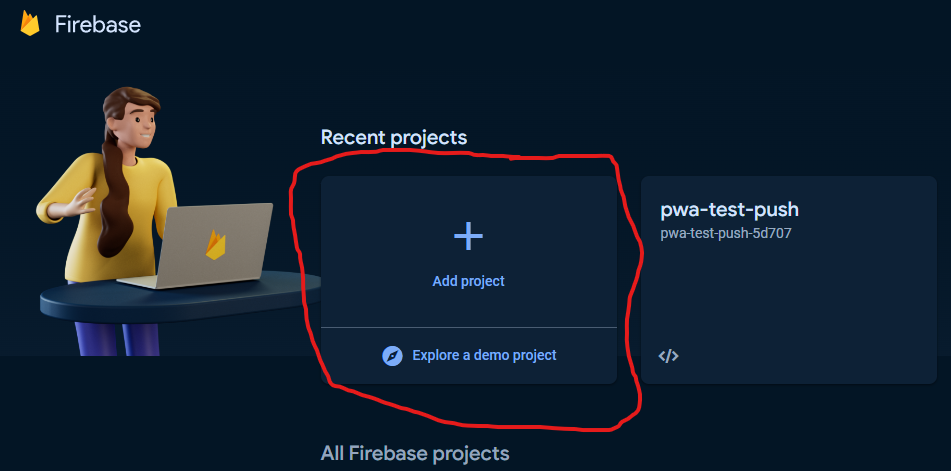
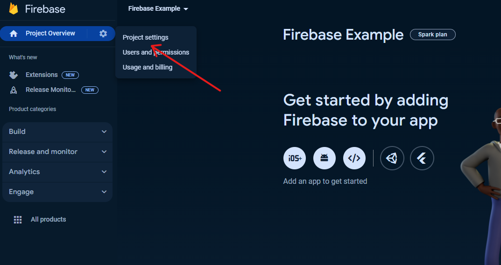
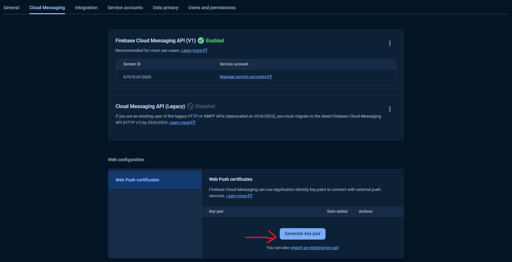
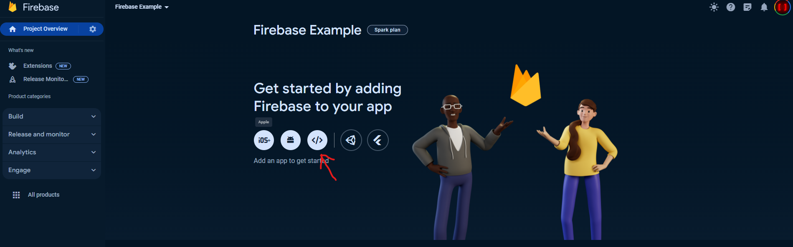
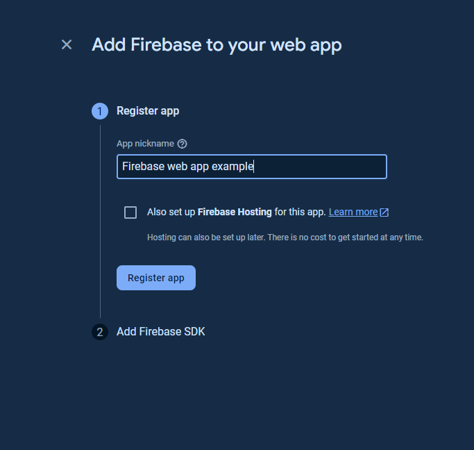
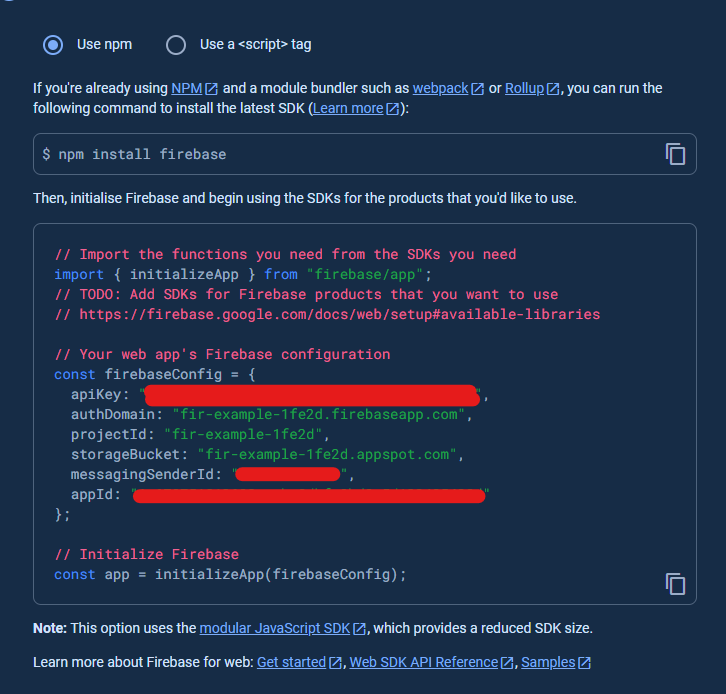
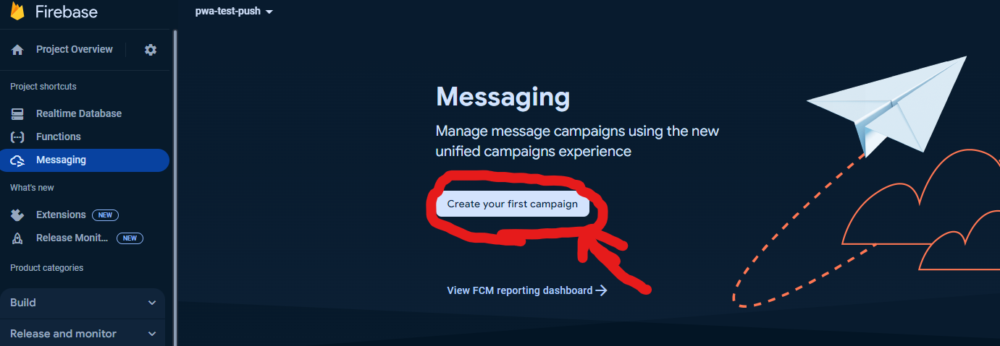
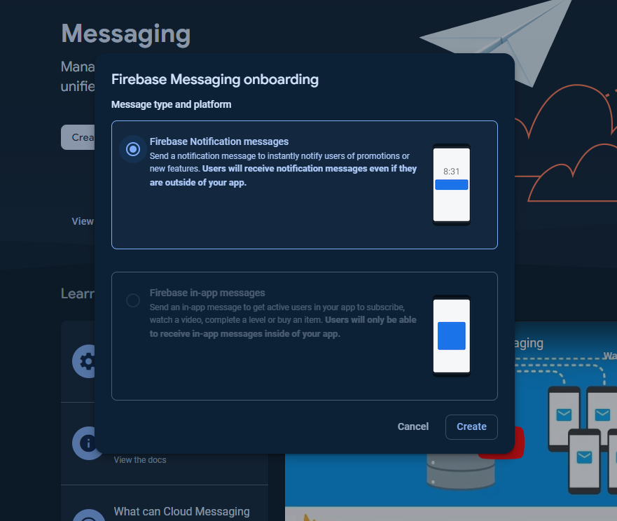
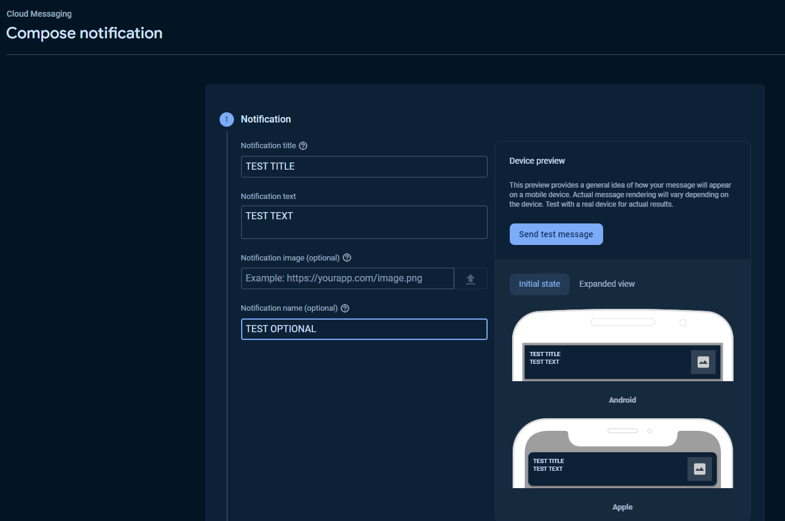
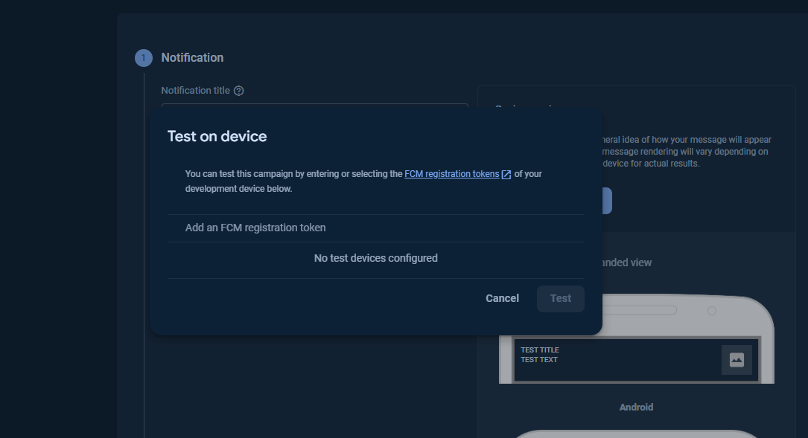

# NextJS 14 + Serwist(For PWA) + Capacitor using App Router

## Installation Guide
1. Clone this project using the github link using `git clone`
2. Go into the project folder, using `cd nextjs-pwa-capacitor`
3. Run `npm install`

## Getting Started

First, run the development server:

```bash
npm run dev
# or
npm run dev:https # run the app with https
#or
yarn dev
# or
pnpm dev
# or
bun dev
```

```bash
# To use Turbo Pack use flag 
--turbo
# But be careful because @servwit / @next-pwa does not work with turbopack (Updated 22 FEB 2024)
```
Related Issue: [Click Here](https://github.com/serwist/serwist/issues/54)

Open [http://localhost:3000](http://localhost:3000) with your browser to see the result.

if your are using `npm run dev:https`, Open [https://localhost:3000](https://localhost:3000) with your browser to see the result.

This project uses [`next/font`](https://nextjs.org/docs/basic-features/font-optimization) to automatically optimize and load Inter, a custom Google Font.

## Project Structure
```bash
/public
	firebase-messaging-sw.js
/src
	/app
		manifest.json
		globals.css
		favicon.ico
		layout.jsx # shared layout for all pages in App router
		page.jsx # similar to index.jsx when using Pages Router
	/components
	/firebase
		firebase.js
		messaging.js # helper functions for FCM, for example getToken or OnTokenRefresh, then do something
	/utils
		/helpers
		/services
		/hooks
		/sw # for service worker
			sw.js
```

## Firebase Cloud Messaging (FCM) Setup  
### 1. Firebase Console Setup
- First we will need to create a project, or use an existing one by going to `console.firebase.google.com` and `Add Project`

- Then we will need to configure `Web Credentials with FCM`. The FCM Web interface uses Web credentials called `Voluntary Application Server Identification`, or `VAPID` keys, to authorize send requests to supported web push services. To create this `VAPID` key, we need to go to `Project Overwiew -> Project settings`.

### 2. Generate key Pair, VAPID key
- On the `Cloud Messaging` tab of the `Project settings`, you will see a `Web Configuration` section, which you will consequently see a button `Generate key pair`.

- After clicking the button, you will see the key pair, which we will use in `VAPID` key when using `getToken()` in our PWA App
### 3. Add Web App
- On the `Project Overview` tab of your `Firebase Console`, if you have no `app` added to your project you will see a `Get Started` header, click on your preferred app to add, for this we will go for the `web app` one since we are building a `Progressive Web App(PWA)` experience.

- On the next screen your should see `Register app` with an input for `App nickname`, type your app nickname, if you want `Firebase Hosting` you can click on the checkbox as well, but we will not be using that.

- Consequently, you will see the below, which will tell to install the `Firebase SDK` using `npm install firebase` and more importantly your `Firebase Config`, click on the `Continue to the Console`

- If you need the `Firebase Config` again, you can always find it in `Project settings -> General -> Scroll to `*`Your apps`*

### Setup PWA with Firebase
1. On the root of your project, run `npm install firebase`;
2. In the `src/` folder, create `firebase/` folder
	- Add/Create 2 files in it, `firebase.js`, `messaging.js`
3. In `firebase.js`, add your `Firebase Config`:
```js
import { initializeApp } from 'firebase/app';
import { getAuth } from 'firebase/auth';
import { getFirestore } from 'firebase/firestore';
import { getMessaging, isSupported } from 'firebase/messaging';
import { getStorage } from 'firebase/storage';

// Configure Firebase.
const firebaseConfig = {
    apiKey: "<REPLACE-YOUR-API-KEY>",
    authDomain: "fir-example-1fe2d.firebaseapp.com",
    projectId: "fir-example-1fe2d",
    storageBucket: "fir-example-1fe2d.appspot.com",
    messagingSenderId: "<REPLACE-YOUR-MESSAGING-SENDER-ID>",
    appId: "<REPLACE-YOUR-APP-ID>",
};

export const app = initializeApp(firebaseConfig);
// Call by await messaging() everytime a messaging instance is needed
export const messaging = async () => await isSupported() && getMessaging(app); 
```
4. Create a service worker for FCM, in your public folder, add/create `firebase-messaging-sw.js`, and we can leave it blank since we will be incorporating the configuration the `FCM` service worker in our own service worker, `src/utils/sw/sw.js`.
5. In `src/utils/sw/sw.js`:
```js
import { defaultCache } from "@serwist/next/browser";
import { installSerwist } from "@serwist/sw";
import { initializeApp } from "firebase/app";
import { getMessaging, onBackgroundMessage } from "firebase/messaging/sw";

installSerwist({
    precacheEntries: self.__SW_MANIFEST,
    skipWaiting: true,
    clientsClaim: true,
    navigationPreload: true,
    runtimeCaching: defaultCache,
});

const firebaseConfig = {
    apiKey: "<REPLACE-YOUR-API-KEY>",
    authDomain: "fir-example-1fe2d.firebaseapp.com",
    projectId: "fir-example-1fe2d",
    storageBucket: "fir-example-1fe2d.appspot.com",
    messagingSenderId: "<REPLACE-YOUR-MESSAGING-SENDER-ID>",
    appId: "<REPLACE-YOUR-APP-ID>",
};

const firebaseApp = initializeApp(firebaseConfig);
const messaging = getMessaging(firebaseApp);

onBackgroundMessage(messaging, (payload) => {
    console.log(
        '[firebase-messaging-sw.js] Received background message ',
        payload
    );
    // Customize notification here
    const notificationTitle = 'Background Message Title';
    const notificationOptions = {
        body: 'Background Message body.',
        icon: '/firebase-logo.png'
    };
  
    self.registration.showNotification(notificationTitle, notificationOptions);
});
```
*You might have other service worker actions in `sw.js`, this part only reflect a default one*

6. As observed in `sw.js`, we only handled `OnBackgroundMessage`, which will be called when the app is in the background and it receives messages, for `foreground` messages, we use `OnMessage` directly in our *pages*, for example here in `page.jsx`:
```js
// Just make sure we use it in client compoenents and not in server components, as we need the navigator
// to be available to use and to be defined.
useEffect(() => {
	const messaging = getMessaging();
	onMessage(messaging, (payload) => {
		console.log('Message received. ', payload);
		// ...
	});
}, []);
```

7. __[ Optional ]__ If you want to have the `Firebase Configuration` in `sw.js` to be in the recommended `firebase-messaging-sw.js`, you should, then in that case your `import`'s will be different as you will using `importScripts`, below is an example:
```js
importScripts('https://www.gstatic.com/firebasejs/8.10.1/firebase-app.js');
importScripts('https://www.gstatic.com/firebasejs/8.10.1/firebase-messaging.js');

const firebaseConfig = {
    apiKey: "<REPLACE-YOUR-API-KEY>",
    authDomain: "fir-example-1fe2d.firebaseapp.com",
    projectId: "fir-example-1fe2d",
    storageBucket: "fir-example-1fe2d.appspot.com",
    messagingSenderId: "<REPLACE-YOUR-MESSAGING-SENDER-ID>",
    appId: "<REPLACE-YOUR-APP-ID>",
};

firebase.initializeApp(firebaseConfig);
const messaging = firebase.messaging();

messaging.onBackgroundMessage((payload) => {
    console.log(
        '[firebase-messaging-sw.js] Received background message ',
        payload
    );
    // Customize notification here
    const notificationTitle = 'Background Message Title';
    const notificationOptions = {
        body: 'Background Message body.',
        icon: '/firebase-logo.png'
    };
  
    self.registration.showNotification(notificationTitle, notificationOptions);
});
```

8. This snippet is important, as with this, you will get a `FCM Registration Token`, which will act as a `device id` for the devices needed to connect to `Firebase Cloud Message`:
```js
    const msg = await messaging();
    const registration = await navigator.serviceWorker.ready;
    console.log("registration", registration)
    const fcmToken = await getToken(
        msg,
        {
            serviceWorkerRegistration: registration, 
            vapidKey: VAPID_KEY // put the key pair you generated here
        }
    );

	if (fcmToken) {
        console.log('Got FCM device Token: ', fcmToken);
		// You might want to store this token in your app server to keep track of all device ids registration
	}
```
9. __[ NOTE ]__ : Don't forget to `request permission for notifications` to the user:
```js
function requestPermission() { // you can call this function where it is need, or in the layout.jsx itself
  console.log('Requesting permission...');
  Notification.requestPermission().then((permission) => {
    if (permission === 'granted') {
      console.log('Notification permission granted.');
	}
  });
}
```

10. After all of the above, you should be to `Send a test message` in `Firebase Console`.

### Sending a test from Console
1. In your project's `Firebase Console`, go to `Messaging`.
2. Then if you do not have an existing `campaign`, create one:

3. Then choose `Firebase Notification messages`, then `Create`:

4. On the next page, enter some details, then click on `Send test message`:

5. Add your `FCM Device Token`, we got from the `console.log` in the PWA App in the `Add an FCM registration token`, and then click `Test`:

6. If everything goes well, you should be able to see your notification when the app in the `background` or `foreground`.
7. __[ NOTE ]__: Sometimes you might need to refresh the `Send test message` page in the `Firebase Console` to actually see a result.

## PWA Notes for Development 
- When app is running using `npm run dev:https`, certicates will be created. 
- For Windows, not much is need to be done to allow `installation` as desktop app
- For Android, you need the `CA Certificate`:
	1. `Root CA`, which need to be installed on Android, `Settings -> search for Install Certificate -> CA Certificate`
	2. `Root CA` is located at `C:\Users\<USER>\AppData\Local\mkcert` by default, copy and paste to your android and then install it

### Capacitor
Generally, you don't need to run `npx cap sync` or `npx cap copy` while you're focusing solely on PWA development. These commands are used primarily for native development to copy web assets into the native platforms (iOS/Android) and apply any necessary configuration or plugin updates. When developing a PWA, you're essentially working on a web application, so your usual web development workflow applies.

*__NOTE__: If you plan to test or deploy your application as a native app (on iOS or Android), that's when `npx cap sync` or `npx cap copy` come into play. `npx cap sync` is a comprehensive command that updates dependencies, copies web assets, and applies any configuration changes to the native projects. `npx cap copy` is more specific and only copies the web assets to the native projects. If you've made changes to Capacitor plugins or the native configurations, you'll need to use `npx cap sync.`*

### Useful Resources 

#### Mercure: [Cick to learn More](https://mercure.rocks/docs/getting-started)
#### Capacitor: [Click Here to learn More](https://capacitorjs.com/docs/)
- __IOS__: [Docs](https://capacitorjs.com/docs/ios)
- __Android__: [Docs](https://capacitorjs.com/docs/android)
- __Web/PWA__: [Docs](https://capacitorjs.com/docs/web)
	- [PWA Elements](https://capacitorjs.com/docs/web/pwa-elements)

## Tips 
- if constant loop full-reload:
	- Stop the Next Server
	- go to Application Tab in Browser DevTools
	- Unregister all related service workers
	- Then go to storage in Application Tab and then `clear site data`

## Web APIs Documentation from https://web.dev:
1. __Notifications__: [Click Here](https://web.dev/explore/notifications)
	- Displaying a Notification: [Click Here](https://web.dev/articles/push-notifications-display-a-notification)
2. __Make your PWA feel more like an APP__: [Click Here](https://web.dev/articles/app-like-pwas)

## Firebase Docs
1. __Setting Up Firebase JS__: [Click Here](https://firebase.google.com/docs/web/setup#add-sdk-and-initialize)
	- `firebaseConfig`: [Click Here](https://firebase.google.com/docs/web/learn-more#config-object)
2. __Using Firebase Cloud Messaging JS__: [Click Here](https://firebase.google.com/docs/cloud-messaging/js/client)

## Useful Resources:

### [NextUI](https://nextui.org/docs/):
- App Router Setup Guide: [Click Here](https://nextui.org/docs/guide/upgrade-to-v2#app-directory-setup)

### [Aceternity UI](https://ui.aceternity.com):
- Docs: [Click Here](https://ui.aceternity.com/components/)

#### Notes for App Router :
1. For `components`, use the component from the individual package not the from `@nextui-org/react`, some examples below:
	- `Button`: `import { Button } from '@nextui-org/button'`
2. Make sure not to use `/test` for testing client side components for, it causes `originalFactory is not defined error`.

## Learn More

To learn more about Next.js, take a look at the following resources:

- [Next.js Documentation](https://nextjs.org/docs) - learn about Next.js features and API.
- [Learn Next.js](https://nextjs.org/learn) - an interactive Next.js tutorial.

You can check out [the Next.js GitHub repository](https://github.com/vercel/next.js/) - your feedback and contributions are welcome!
